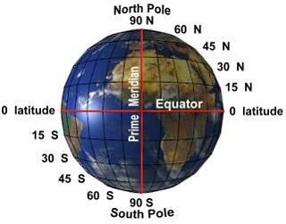
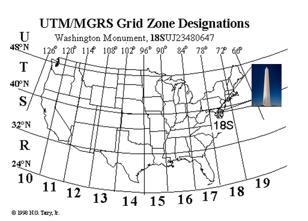
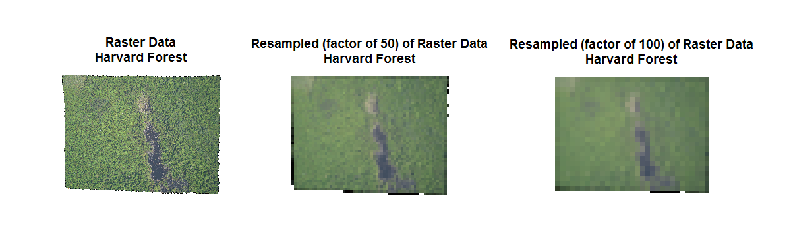

##About
This lesson will introduce spatial and temporal data.

**Experience required:** No prior experience or knowledge required

<h3>Goals / Objectives</h3>
After completing this activity, you will:
<ol>
<li>Know the definition of spatial data</li>
<li>understand that spatial data come in many forms and formats</li>
<li>understand what the spatial data structure types are - raster and vector</li>
<li>understand what raster data are</li>
<li>understand what vector data are</li>
<li>understand that the data types are implemented differently</li>
<li>understand that you need special tools to be able to access spatial data</li>
<li>understand that working with different file types requires different tools</li>
<li>understand that you can have multiple data and file types for a single area</li>
<li>understand that you can look at datasets individually or in combination</li>
<li>understand that there is necessary metadata associated with and/or embedded in the data</li>
<li>understand that collecting data requires/includes collecting the metadata</li>
<li>understand that there is potentially ancillary data associated with individual elements (like NEON tower data (point), road (line), watershed (polygon))</li>
<li>understand that you also can work with data over time for the same area. You can ask question over time using spatial data. (incl timestamp mention here?)</li>
</ol>

<h3>Things You'll Need To Complete This Lesson</h3>

<h4>Tools To Install</h4>

<h4>Data to Download</h4>

<h4>Recommended Pre-Lesson Reading</h4>

------
## About spatial data

<h4>Starting exercise</h4>  

With the person next to you, take just one minute and discuss what you think are examples of spatial data and why.

<ul>
<li>What are some of the examples you came up with?</li>
<li>What makes these examples of spatial data?</li>
</ul>

<i>Spatial data are any data that have geographical coordinates associated with them.</i>

<ul>
<li>What is a coordinate system?</li>
</ul>

<i>It tells you where you are on the surface of the Earth.</i> 

To tell you where you are, you need three pieces of information:

<ul>
<li>ellipsoid, </li>
<li>projection, </li>
<li>datum</li>
</ul>

Think about a globe of the earth. It's a 3D ellipsoid (simplified model of Earth's shape). You don't work with globes though, instead we work with maps, 2D representations of the earth or areas of the earth. To move from that 3D to the 2D representation, we need to know certain things about how that projection was done.

<ul>
<li>You need to know what model of the earth you're using, (ellipsoid)</li> 
<li>how you've created your 2D map from the 3D earth (projection)</li>
<li>and what's the central reference  point of the map (datum).</li>
</ul>

When you're working with spatial data, you usually want all the maps that you're working with to employ the same coordinate system.

Not having the correct information on the coordinate system used may lead to dramatic errors!

Image from https://foundonweb.files.wordpress.com/2014/06/misalignment-of-the-rails.jpg

There are many different coordinate systems but two major categories:
<ol>
<li>Geographic coordinate systems (no projection)</li>
<li>Projected coordinate systems</li> 
</ol>

###Geographic coordinate systems
Latitude and longitude is a coordinate system, because it does tell you where you are on the earth. But, because it's dealing with the 3D earth, it doesn't have a projection. It does have a datum, which is 0 longitude, 0 latitude, where the Prime Meridian and Equator meet.

###Projected coordinate systems
Another unit system is Northings and Eastings, and this is often used with GPS units. In this coordinate system, the ellipsoid is [WGS84](http://earth-info.nga.mil/GandG/wgs84/index.html), the projection is Universal Transverse Mercator [UTM](http://earth-info.nga.mil/GandG/coordsys/grids/universal_grid_system.html) and the datum varies depending on where you are. In the US it's usually [NAD83](https://en.wikipedia.org/wiki/North_American_Datum) (North America Datum 1983).

If you were at the Washington Monument in Washington DC for example, you would report your Northings and Eastings coordinates as:

4,306,481.40 m North, 323479.84 m East, UTM Zone 18S

and that says that you're 4,306,481.40 m north and 323479.84 m East of the zero point for Zone 18, which is the lower left of that zone. 

Picture of the Washington monument in Zone 18

Once you know all this information, you can convert site location between coordinate systems.

### Types of spatial data

Spatial data is represented in many different ways and file formats. This is often because there are different scales or measuring devices or people just
like one or the other. It can seem a little overwhelming, but these data types will generally conform to standards.

There are two broad categories of spatial data - raster and vector.

####Raster

- In a grid
- In rows and columns
- Every spot in the grid has a value - spatially extensive  
- Every grid represents a single variable - it's just measuring one thing, like elevation would be one file and soil temperature would be another file.
- The resolution or grid cell size can be different sizes between files

--- Same raster image but with different grid sizes

***Advantages of using raster data format***

<ul>
<li>The geographic location of each grid point is defined by its position in the 2D grid.</li>
<li> Due to the nature of the data storage technique data analysis is usually easy to program and quick to perform. </li>
<li>Suitable for analysis of multi-layer or multivariate data (e.g., satellite image processing and analysis)</li>
</ul>

***Disadvantages of raster data format***
<ul> 
<li>The cell size determines the resolution at which the data is represented.; It is especially difficult to adequately represent linear features depending on the cell resolution. </li>
<li>unapproriate cell size may trigger problems</li>
<li>disk space can become an issue as the entire grid needs to be stored.</li>
</ul>

####Vector

- points, lines or polygons
- not spatially extensive
- used if you want to measure particular features in an area
- examples, a point is a tower, a line is a transect, river or road and a polygon is a water shed
- you can have more than one measured variable for each element

--- picture of vector data

Each of these has different file types. There are a lot of file types within each category, but particular file types are associated with a particular data type.

-- Link to file types page.

If you're interested in a particular area, you can combine information or overlay data from both of these types.

For instance we can combine the Harvard forest land cover map (raster) and the boundary of the forest (vector data) and the tower.

We're going to focus on two common examples, one for raster and one for vector, in this workshop.

You need special tools to be able to open, read and manipulate these files. We will be using R in this workshop. There's also a lot of other options including things like ArcGIS and Q-GIS and GRASS.

--- Maybe link to other tools

### Metadata

With spatial data there is information that's necessary to understand it, but usually isn't included in the file.  This is the metadata. Data about the data.

Use a file type. Show the raster of Harvard forest. Ask, what can you say
about this data?

What would you want/need to know about this data to be able to answer questions using this data?

- where is this?
- what coordinate system?
- date?
- time?
- instrument?
- what's being measured?
- what units?

With this file type as is, can you figure any of these things out?

No, you can't figure this out. You need the data about the data. This is the metadata. This information is sometimes embedded in the file (we'll talk about this) or a separate file that contains this information. Sometimes it's in the download directory, but other times, it's just listed on a web site or in another directory and you need to seek it out.

-- show cropland data layer as an example of a data repository that has the metadata on its web site, not when you download it

Metadata comes in many formats, but generally is a text file like txt, CSV or XML.

### Ancillary data

Each element in the file can have more data associated with it. This can be things like a measured time series for an individual point or vector.

This is often things like CSV files. They don't have a spatial element. You have to attach that data to the spatial data information.

There also can be raster or vector data for the same area over time.

All these different data types and series can be combined or compared.

### Resources:
more on coordinate systems:
- http://docs.qgis.org/2.0/en/docs/gentle_gis_introduction/coordinate_reference_systems.html
- http://docs.qgis.org/2.0/en/docs/gentle_gis_introduction/coordinate_reference_systems.html#coordinate-reference-system-crs-in-detail
-http://earth-info.nga.mil/GandG/coordsys/http://earth-info.nga.mil/GandG/coordsys/grids/universal_grid_system.html
- https://www.fgdc.gov/usng/how-to-read-usng

more on file types:
- https://en.wikipedia.org/wiki/GIS_file_formats
lists of tools (many open source) to work with spatial data:
- https://en.wikipedia.org/wiki/List_of_geographic_information_systems_software
- https://en.wikipedia.org/wiki/List_of_spatial_analysis_software
